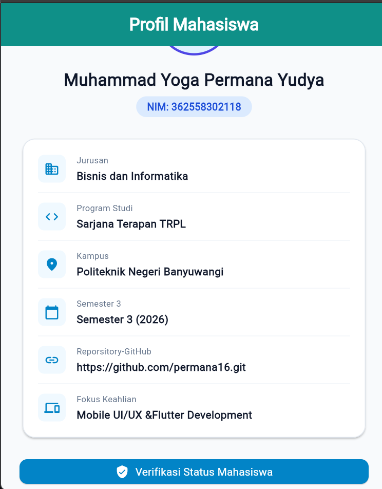

# Laporan Praktikum Modul 01: Mobile Ecosystem, Flutter Setup & Profile App

- **Nama**: Muhammad Yoga Permana Yudya
- **NIM**: 362558302118
- **Kelas / Prodi**: 2A / TRPL
- **Mata Kuliah**: Pemrograman Perangkat Bergerak (Semester 3)

## 1. Ringkasan Aktivitas
Pada praktikum pertemuan pertama ini saya belajar dasar ekosistem pengembangan aplikasi mobile menggunakan flutter
sebagai awal pembelajaran berikut materi yang dipelajari perbedaan Native, Hybrid, dan Cross-Platform, 
arsitektur tiga lapisan Flutter, JIT dan AOT, konsep declarative UI, Widget Tree, Sound Null Safety, serta perbedaan 
Hot Reload dan Hot Restart.

## 2. Bukti Tangkapan Layar (Running App)
potret

## 3. Kendala yang Dihadapi & Solusinya
- **Kendala**: error di cmdline-tools saat flutter doctor
- **Solusi**: install cmdlinetools di web resmi flutter sesuai
ios masing-masing
- **Kendala** : error pada flutter PATH
- **Solusi** : karena file flutter yang benar ada di penyimpanan D bukan di C 
maka tinggal menghapus file flutter yang ada di penyimpanan C atau local disk C.

## 4. Jawaban Pertanyaan Refleksi
1. **Pilihan Native vs Flutter** :
    *Jawaban* : Ketika project yang saya kerjakan membutuhkan performa yang maksimal
    dan memerlukan akses yang sangat cepan atau instan ke hardware.
2. **Prinsip UI = f(state)** :
    *Jawaban* : Alur berpikirnya berubah menjadi Bagaimana bentuk UI ini pada kondisi
    (state) tertentu, Kita cukup mendeklarasikan struktur UI menggunakan widget-widget
    (seperti Text(mahasiswaName)).Ketika data (state) berubah, Flutter akan secara otomatis
    merekonstruksi (rebuild) sub-pohon widget tersebut untuk menyelaraskan tampilannya secara instan.
    Karena widget di Flutter bersifat immutable (tidak dapat diubah), Flutter tidak memodifikasi widget 
    lama melainkan langsung membuat instansiasi widget baru untuk menggantikan yang lama dengan aman dan 
    efisien. Ini membuat alur program jauh lebih mudah dipahami.
3. **Pentingnya Conventional Commits** :
    *Jawaban* : Commit sangat penting karena mempermudah untuk mengetahui perubahan,
    penjelasan apa yg diubah, tujuan kode tersebut diubah. lalu mempermudah perbaikian 
    jika terjadi bug atau error pada commit. commit juga sangat berpengaruh untuk karir 
    kedepannya karena tidak hanya terlihat rapi pada riwayat git namun juga dapat menunjukkan bahwa 
    riwayat git menjadi jejak proses belajar dan berkembang seorang developer.