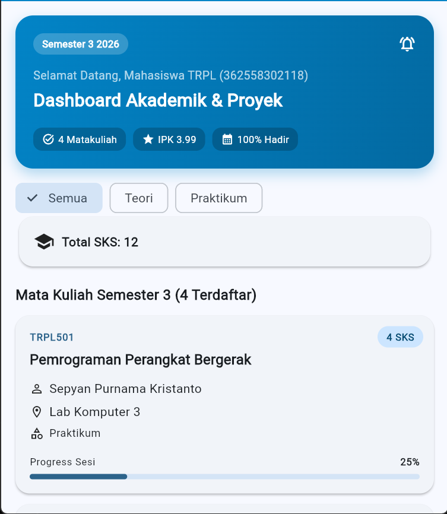
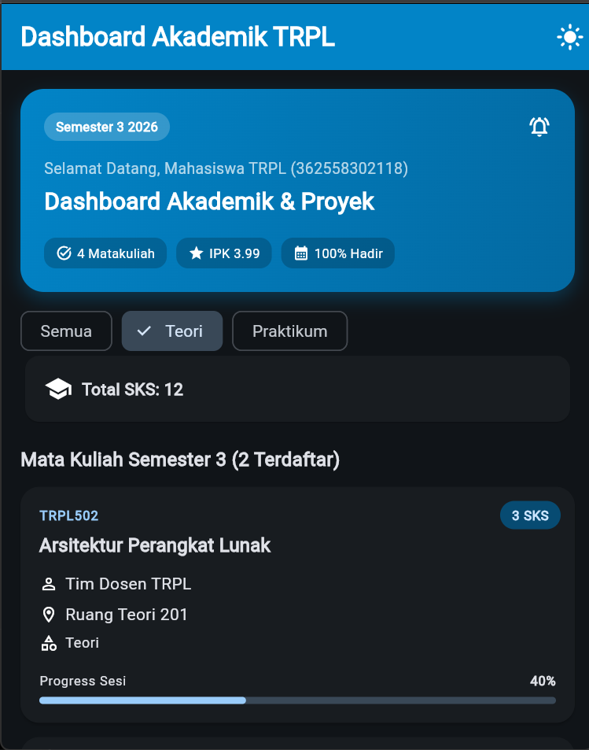
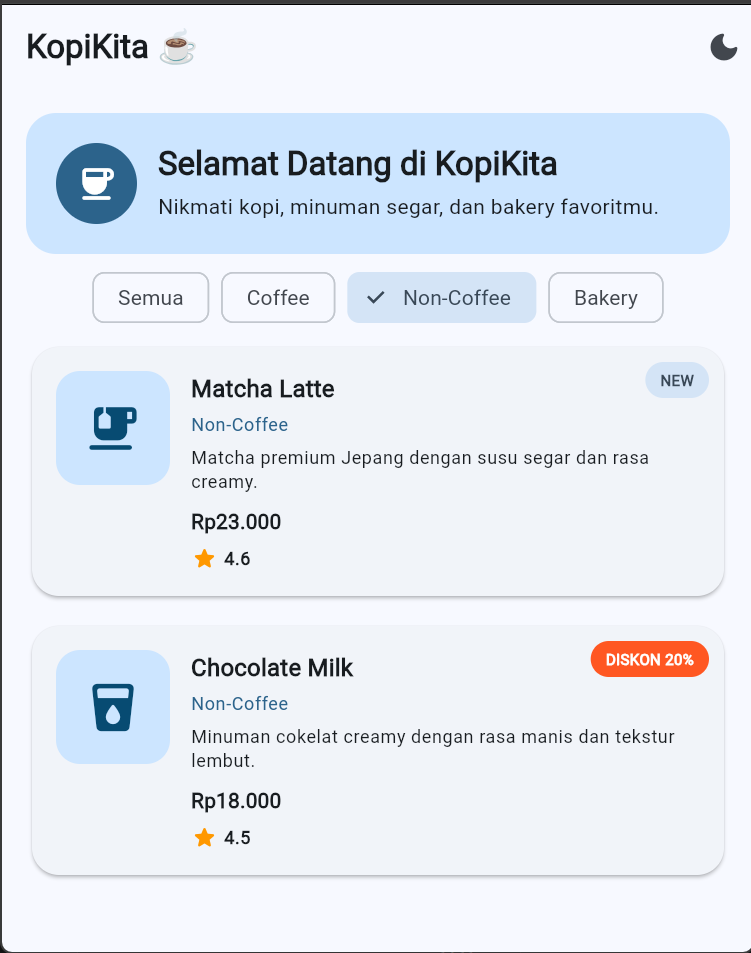
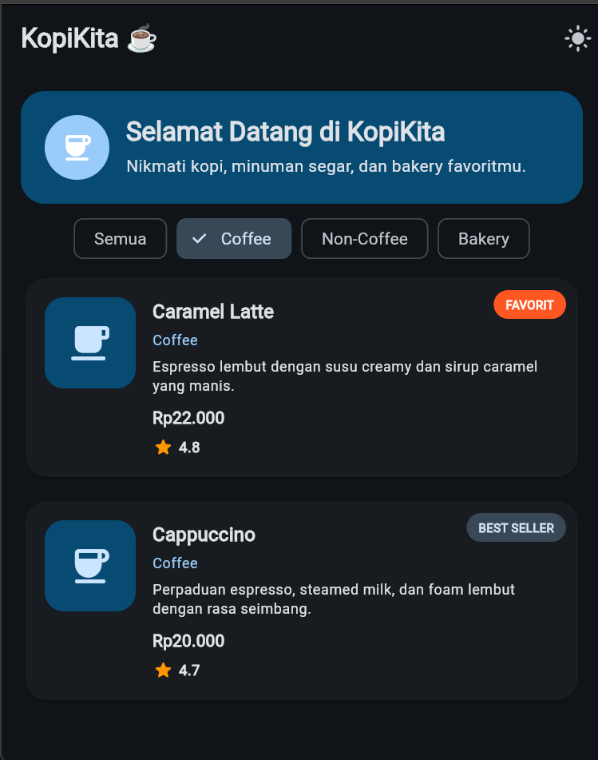
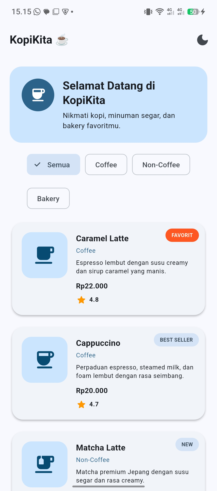
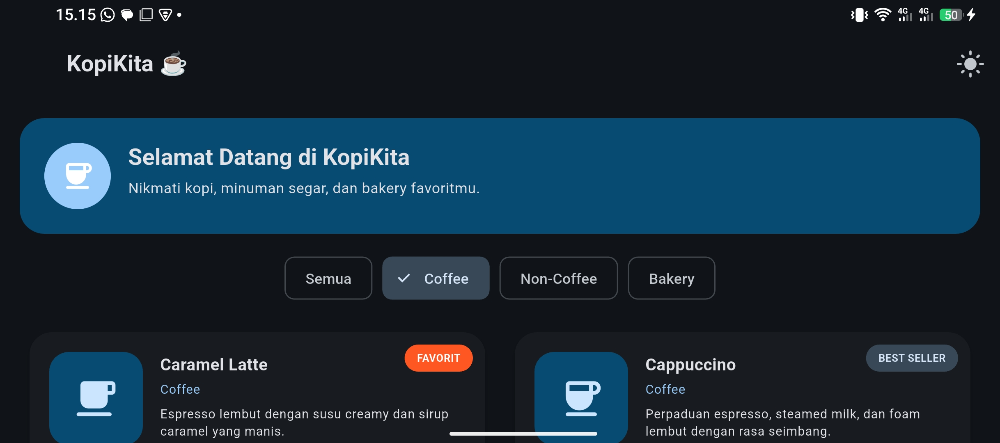

# Laporan Praktikum Modul 01: Mobile Ecosystem, Flutter Setup & Profile App

- **Nama**: Muhammad Yoga Permana Yudya
- **NIM**: 362558302118
- **Kelas / Prodi**: 2A / TRPL
- **Mata Kuliah**: Pemrograman Perangkat Bergerak (Semester 3)

## 1. Ringkasan Implementasi
[Jelaskan bagaimana Anda merancang antarmuka pemesanan KopiKita dengan LayoutBuilder responsif, filter kategori Wrap & ChoiceChip, Stack & Positioned untuk badge promo/rating, dan tema Material 3]
Saya merancang tampilan pemesanan yang menyesuaikan ukuran gadget untuk membuat tampilan yang responsif menggunakan 'LayoutBuilder' dengan 600dp. untuk daftar produk ditampilkan dalam satu kolom menggunakan 'ListView.builder'sedangkan pada layar 600 dp atau lebih, produk ditampilkan dalam grid dua kolom menggunakan GridView.builder. untuk filter berdasarkan kategori saya menggunakan wrap dan ChoiceChip ada 3 jenis kategori yaitu coffe, non-coffe, bakery jika user memilih salah satu kategori tersebut maka setState() akan dipanggil sehingga daftar halaman langsung berubah tanpa harus me-reload halaman.
Pada setiap kartu produk menggunakan Stack dan Positioned untuk menempatkan badge proo seperti favorit, diskon 20%.Untuk tampilan keseluruhan, saya menggunakan Material 3 ThemeData yang dipusatkan pada MaterialApp. Aplikasi menyediakan Light Mode dan Dark Mode, sehingga tampilan berbagai komponen dapat mengikuti tema secara konsisten.

## 2. Bukti Tangkapan Layar (Running App)
screenshot praktikum:
 | 

screenshot bagian 5 tugas mandiri:
 |  |  | 

## 4. Jawaban Pertanyaan Refleksi
1. Jelaskan dengan kalimat Anda sendiri mengapa aturan “Constraints go down, Sizes go up, Parent sets position” membuat proses komputasi layout di Flutter sangat efisien (O(N) single-pass rendering)!
Jawab:  karena parent memberikan constrains kepada child lalau constrains tersebut memberi tahu kecil atau besar ukuran yang diperbolehkan. Setelah menerima constrains, chils menentukan ukuran yang paling sesuai dan mengembalikan ukuran tersebut kepada parent. Setelah itu, parent menentukan posisi akhir child di dalam layout.
2. Kapan sebuah widget sebaiknya dipecah menjadi file widget terpisah (seperti CourseCard), dan kapan cukup diletakkan sebagai private widget di file yang sama?
Jawab: ketika widget sering digunakan secara berung, memiliki tanggung jawab yang rumit. contohnya: CoffeeCard memiliki banyak fungsi seperti menampilkan data produk, badge, rating, interaksi InkWell, dan showModalBottomSheet. Karena cukup rumit dan merupakan komponen utama yang dapat digunakan berulang kali untuk setiap produk, widget tersebut lebih baik ditempatkan di file terpisah:
3. Bagaimana penggunaan tema terpusat (ThemeData M3) mempermudah pemeliharaan kode aplikasi skala besar dibandingkan memberi warna manual pada setiap widget?
Jawab: ThemeData membuat warna dan style aplikasi dikelola dari satu tempat. Hal ini mengurangi pengulangan kode, menjaga konsistensi, dan mempermudah perubahan tema Light/Dark pada aplikasi besar.