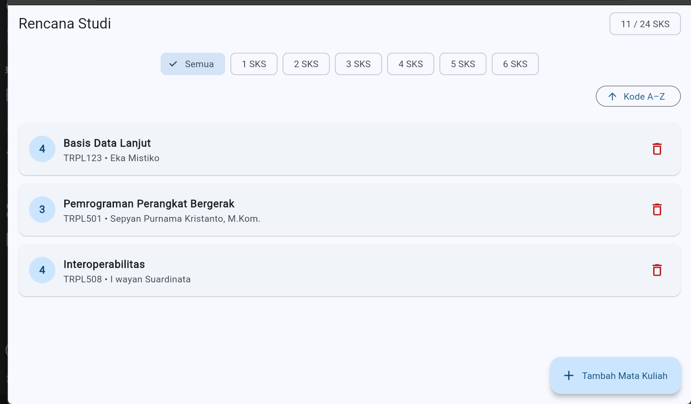
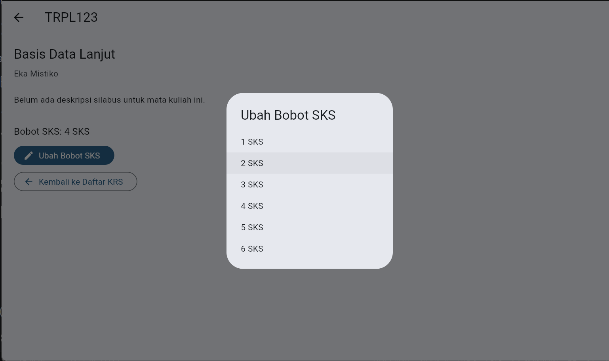

# Laporan Praktikum Modul 03: navigasi dasar dan Form

- **Nama**: Muhammad Yoga Permana Yudya
- **NIM**: 362558302118
- **Kelas / Prodi**: 2A / TRPL
- **Mata Kuliah**: Pemrograman Perangkat Bergerak (Semester 3)

# Screenshot tamilan
 |  | 

# Jawaban Pertanyaan
                                                        A                           B
Di mana daftar mata kuliah disimpan?	 | _KrsListScreenState._courses	| Melalui KrsNotifier/Riverpod
Bagaimana layar detail menerima data?	 | Objek lewat konstruktor      | melalui Url
Bagaimana form menyerahkan hasilnya?	 | pop(context, course)	        | state
Bagaimana daftar tahu ia harus dibangun  | ulang?	setState	        | Riverpod melakukan rebuild ketika state provider berubah
Berapa berkas yang berubah bila menambah satu layar baru? |	Biasanya 2–3 berkas: screen baru dan file yang melakukan navigasi (serta file lain jika diperlukan)	| Biasanya 1–2 berkas: screen baru dan konfigurasi app_router.dart

1. ayar detail perlu berubah menjadi StatefulWidget. Jelaskan dalam laporan mengapa perubahan itu diperlukan.
Jawab: Karena untuk memperbarui tampilan aplikasi saat terjadi perubahan data atau interaksi dengan pengguna, dan juga StatefulWidget digunakan untuk meemanggil fungsi setState().

# Pertanyaan Refleksi
1. Di Fase A, _courses tinggal di dalam _KrsListScreenState. Di Fase B ia pindah ke KrsNotifier. Menurut Anda, apa yang menjadi lebih mudah dan apa yang menjadi lebih sulit setelah perpindahan itu? Sebutkan satu hal untuk masing-masing.
Jawab: 
mudah: state dapat digunakan banyak layar tanpa harus mengirimkan data melalui banyak parameter. 
sulit: struktur program menjadi lebih kompleks atau rumit.

2. Pada Latihan 1, layar detail harus berubah menjadi StatefulWidget agar bisa diperbarui. Padahal di modul ini disebutkan layar detail tidak perlu menyimpan state. Apa yang berubah sehingga simpulan sebelumnya tidak lagi berlaku?
Jawab: Pada Latihan 1, detail diberi perilaku baru, yaitu tombol “Ubah Bobot SKS” yang menerima nilai baru melalui pop. Setelah nilai tersebut kembali, tampilan detail harus berubah selama layar masih terbuka.

3. Andaikan aplikasi KRS ini hanya akan punya tiga layar selamanya. Apakah menambahkan go_router dan Riverpod masih sepadan? Jelaskan alasan Anda dengan menyebut jumlah berkas dan baris kode.
Jawab: 
Untuk aplikasi KRS yang selamanya hanya memiliki tiga layar, penambahan go_router dan Riverpod cenderung menambah kompleksitas yang tidak terlalu diperlukan. Fase A sudah dapat menyelesaikan tiga layar dengan Navigator.push/pop dan setState, sedangkan Fase B harus menambahkan konfigurasi router, provider/notifier, serta versi screen pengayaan. Struktur Fase A sendiri berisi sekitar 6 berkas inti: file aplikasi, model, 3 screen, dan widget tile; sedangkan Fase B memiliki sekitar 7 berkas di folder pengayaan, termasuk README, entry app, app_router, krs_provider, dan 3 screen.

4. Jebakan list const di langkah 5 lolos flutter analyze tanpa peringatan. Menurut Anda, mengapa alat analisis statis tidak dapat menangkapnya? Usulkan satu cara agar kesalahan seperti ini tertangkap lebih awal.
Jawab: 
flutter analyze terutama memeriksa kesalahan sintaks, tipe, API, dan pola kode yang dapat diketahui secara statis. Dalam kasus ini, kode seperti final _courses = KrsCourse.getInitialCourses(); secara tipe tetap valid: variabel tersebut memang merupakan List<KrsCourse>, dan pemanggilan add() juga merupakan method yang valid pada List. Masalahnya baru muncul ketika program berjalan, karena list yang sebenarnya dikembalikan adalah const atau unmodifiable sehingga add() melempar UnsupportedError. Modul secara eksplisit menunjukkan bahwa kesalahan ini dapat lolos flutter analyze lalu gagal saat tombol tambah ditekan.