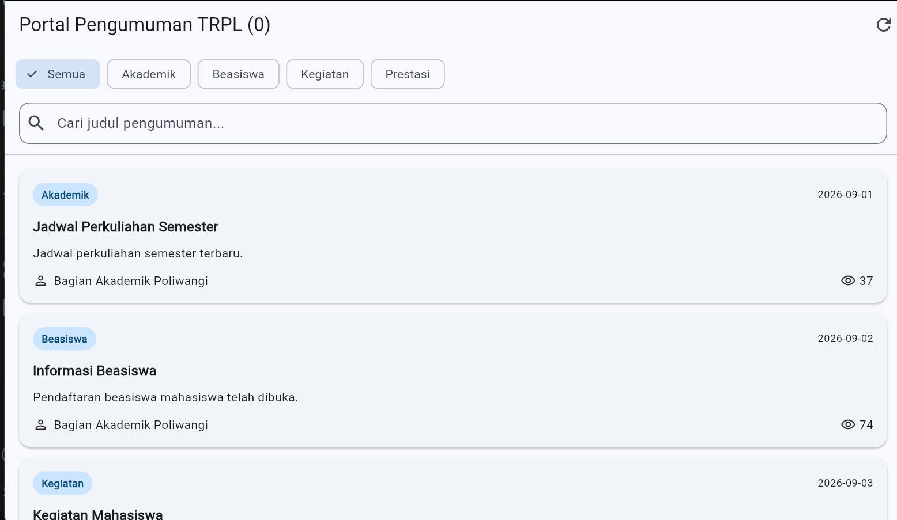
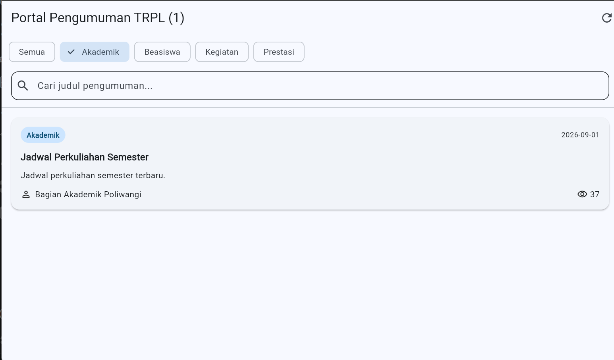
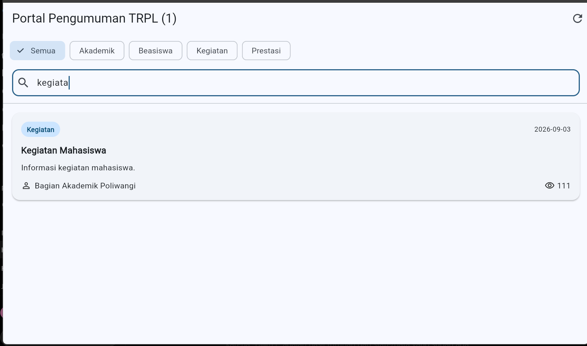

# Laporan Praktikum Modul 03: future dan rest api

- **Nama**: Muhammad Yoga Permana Yudya
- **NIM**: 362558302118
- **Kelas / Prodi**: 2A / TRPL
- **Mata Kuliah**: Pemrograman Perangkat Bergerak (Semester 3)

# Screenshot hasil praktikum
 |  | 

# Pertanyaan refleksi
1. Di Fase A, penyaringan kategori dilakukan di dalam build() dengan where(). Di Fase B, penyaringan itu berpindah ke dalam repository. Menurut Anda, apa yang menjadi lebih mudah dan apa yang menjadi lebih sulit setelah perpindahan itu? Sebutkan satu hal untuk masing-masing.
Jawab: Lebih mudah: UI lebih sederhana karena filter kategori ditangani repository.
Lebih sulit: Repository menjadi lebih kompleks karena harus menangani logika filter.
2. Anda menulis catch (e) { return []; } agar aplikasi tidak pernah crash. Jelaskan mengapa keputusan itu justru membuat aplikasi lebih buruk, dan sebutkan apa yang seharusnya dilakukan.
Jawab: catch (e) { return []; } menyembunyikan error sehingga aplikasi menganggap data kosong, padahal bisa terjadi kegagalan koneksi. Seharusnya error diteruskan dengan rethrow dan ditampilkan sebagai pesan error.
3. Pada Fase A, AnnouncementApi mengembalikan Announcement.getSampleAnnouncements() yang berupa list const. Di Fase B, SampleAnnouncementRepository menyalinnya lebih dulu dengan List.of. Menurut Anda, mengapa Fase A tidak membutuhkan penyalinan itu, sedangkan Fase B membutuhkannya? Kaitkan jawaban Anda dengan operasi apa yang dilakukan masing-masing kelas.
Jawab: Fase A tidak perlu List.of karena list hanya dibaca. Fase B membutuhkan List.of karena list disalin terlebih dahulu agar dapat diolah atau dimodifikasi tanpa mengubah data const asli.
4. Riverpod 3 mencoba ulang provider yang gagal secara otomatis. Menurut Anda, mengapa perilaku itu dipilih sebagai bawaan, dan kapan justru merugikan? Berikan satu contoh situasi untuk masing-masing.
Jawab: Retry otomatis berguna untuk error sementara, misalnya koneksi internet terputus sesaat. Namun merugikan jika error bersifat permanen karena dapat membuat request berulang dan membebani server.
5. Andaikan endpoint pengumuman kampus hanya boleh dipanggil sekali per hari karena kuota. Apakah FutureBuilder di Fase A masih layak? Perubahan apa yang paling sedikit yang perlu Anda lakukan agar kuota itu tidak terlampaui?
Jawab: FutureBuilder masih layak digunakan. Yang perlu diubah adalah menambahkan cache hasil request dan tanggal terakhir request. Jika data hari itu sudah tersedia, gunakan cache sehingga API tidak dipanggil lagi.